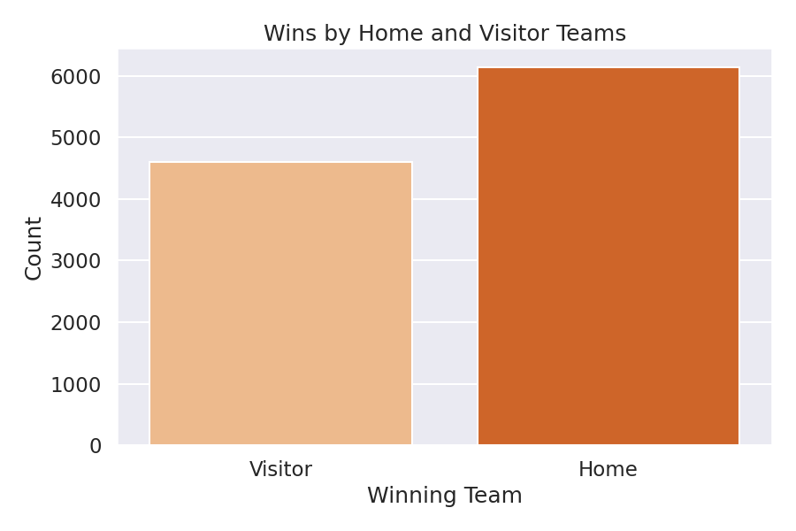
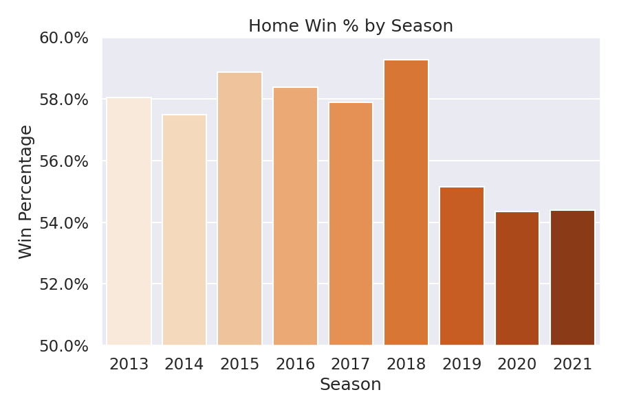
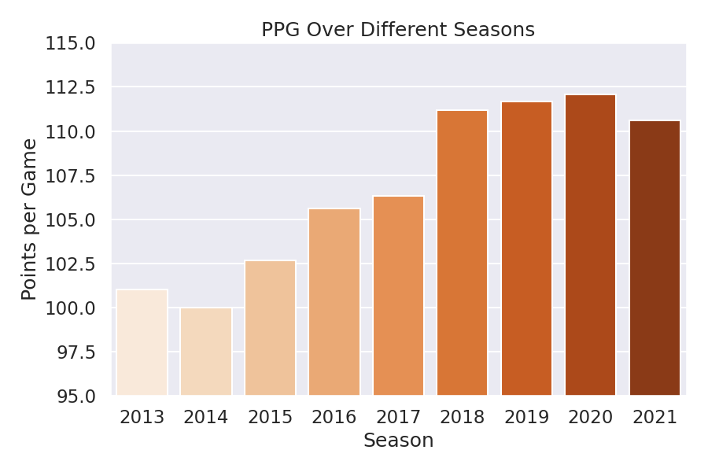

# Predicting the outcome of NBA games
Final project as part of the Lighthouse Labs Data Science Bootcamp. Data used in this project was obtained from [Basketball Reference](https://www.basketball-reference.com/). Work on this project is still ongoing. 

# Goals
 1. Build a machine learning model capable of predicting the outcome of NBA matches. 
 2. Deploy the model by creating a Streamlit app.

# Navigating this Repo
── [`data/`](data): contains all raw data

── [`notebooks/`](notebooks): notebooks containing data preparation, EDA and modelling steps

── [`saves/eval/`](saves/eval): .csv files containing mean accuracy scores and standard deviation 

── [`saves/images/`](saves/images): all visualizations used in this report

── [`saves/processed/`](saves/processed): processed data saved in .csv format

── [`saves/resources/`](saves/resources): resources from different used throughout this repo, including images. 

── [`src/`](src): python script for Streamlit application and pickled files (functions, model, scaler).

# Introduction and Motivation

*Image credit: https://github.com/ChrisKatsaras/React-NBA-Logos* 

The NBA is the main basketball league around the world. The league consists of 30 teams divided into two conferences, and a team plays every other team at least twice. Overall, each team plays a total of 82 games over the course of the regular season. 

A lot of data can be generated during NBA games, for example player and team statistics. This data can be used in several different areas, from player performance analysis to devising a team's strategy against specific opponents. Another area where analyzing NBA data has become important is in the betting industry. A report from 2018 indicated that the NBA could gain an additional $585 million dollars [thanks to legal betting](https://www.legalsportsreport.com/25173/aga-survey-mlb-nba-sports-betting/?doing_wp_cron=1670105815.3058269023895263671875). As legal betting expands worldwide, betting companies could employ machine learning models to offer a fair betting process. 

All that being said, it is suprisingly difficult to predict the outcome of NBA matches. Most models have similar performance at about 65-72%. Another interesting point is that the upset rate (a team with a better win-loss record losing to a team with a worse record) is of around 30%. Therefore, predicting the outcome of NBA matches still remains an interesting topics and many different approaches have been used to tackle this problem. 

# Dataset
Game data can be divided into regular and advanced statistics. Examples of regular statistics are points per game (PPG), two-point shooting percentage (2P%) and three-point shooting percentage (3P%). For advanced statistics, often a combination of different statistics is done. For example, true shooting percentage (TS%) takes into account two-point, three-point and free throw shooting. The purpose of using advanced statistics is to capture nuances about a team that cannot be seen using regular statistics - for example, taking into account the pace or the number of possessions a team has in a game.

For game outcome prediction, both regular and advanced team statistics were used. The data collected was from regular seasons games (playoffs not included) between the 2013 to 2021 seasons (over 10,000 matches). This time window was chosen having in mind that NBA rules and strategies evolve over time, meaning that older data may not be as meaningful in predicting more recent games. As in a typical supervised machine learning problem, the outcome of the game was used as the target or label, and team statistics for both home and visitor team were used as features. 

# Hypotheses
Before actually working with the data, several hypotheses of what impacts game results were proposed: 
* Teams playing at home are more likely to win
* Higher efficiency when shooting (higher 2P%, 3P% or TS%) indicates teams that are more likely to win
* Teams that score a lot in a game are more likely to win (PPG or Offensive Rating - ORtg)
* Teams with strong defensive performances (Defensive Rating - DRtg) are more likely to win

One could consider the impact of these features in a machine learning model by looking at feature importance for a given model. It was also attempted to perform a qualitative analysis of these hypotheses during the exploratory data analysis (EDA) step. 

# Data Processing 
## Data Cleaning, EDA and Feature Engineering
This step involved exploring the game results and team statistics datasets, checking for missing values, evaluating features to use in the model and creating new features. 

### Data Cleaning
Raw data had missing data in columns such as 'Notes', which indicated games that went to overtime or that were played abroad. This kind of information was not useful to the model, so it was dropped. Other team statistics that are not meaningful or redundant were dropped. Team names also had to be formatted to ensure the datasets could be merged. 

### EDA and Feature Engineering
An useful feature to create is the season. This feature is used when merging the game outcomes with team statistics, as there is no point in looking at the 2015 statistics for a game that occurred in 2019. However, this feature is dropped during the model training step since it is not significant to the outcome of the games.

One of the first hypotheses raised was that teams playing at home are more likely to win games. This was initially investigated by looking at the total home wins and visitor wins in the dataset. As can be seen in the figure below, the home team does win more frequently. 

It is also interesting to look at the home and visitor wins in each season to get a better idea of how this factor affects the outcome of games. This information is shown below. While the home team does win more often than the visitors, it does not seem like home court advantage is a deciding factor. One can also notice a decrease in the effect of homecourt advantage starting on the 2019 season - this is due to the COVID-19 pandemic, when teams had to play with no or limited attendance. 

During EDA, it was also possible to notice how trends in the NBA have changed over the years. In recent years, rule changes and playing styles have led to a change in team statistics. This can be evidenced by looking at the average PPG for all teams over the 9 seasons that were evaluated (image below). This increase in average PPG is likely due to increased three-point shooting, teams playing at a faster pace and a higher number of shooting fouls being called. Because of these changing trends in play style, it was decided not to include game data from before the 2013 season, as features could have a different degree of importance back then. 

The hypothesis that teams that can score efficiently are more likely to win was also tested. In fact, not only offense-related statistics (ORtg and TS%) were used in this exercise, but also defensive stats (DRtg), turnover percentage (number of turnovers in 100 possessions - TOV%), and offensive and defensive rebound percentage (ORB% and DRB%, respectively). For this qualitative exercise, first a team ranking based on win percentage was created for each season. Then, a team ranking for each of the team statistics mentioned above was created (advanced stat ranking). Then, the average rank differential is calculated as the difference between a team's position in the win percentage and a given advance stat ranking. For example, the Raptors ranked 12th in wins, 16th in offensive rating and 10th in defensive rating. Toronto's rank differential would be 4 in offensive rating and 2 in defensive rating. Finally, we also calculated the average number of playoff teams that also ranked in the top 10 for each advanced stat. The results are presented in the table below.  

|                 | Avg. Rank Differential | Avg. # PO Teams in Top 10 |
|-----------------|------------------------|---------------------------|
| Off. Rating     |          4.39          |            8.86           |
| Def. Rating     |          4.93          |            8.71           |
| True Shooting % |          4.88          |            9.14           |
| Turnover %      |          8.57          |            6.57           |
| Off. Rebound %  |          10.03         |            5.42           |
| Def. Rebound %  |          8.71          |            6.14           |

The above exercise is purely qualitative, but it is still possible to see that some categories matter more when it comes to winning. For example, TS% shows a small average rank differential, indicating that teams which score the ball efficiently are more likely to win games. This is also highlighted by the average number of playoff teams in the top of this category (9.14). On the other hand, TOV% does not seem to be as impactful in predicting if a team is successful, given that it has higher average rank differential and that the average number of playoff teams in the top 10 of this category is lower than for TS%.

# Predictive Model
## Methodology
This problem was approached as a supervised learning problem. The label was the outcome of the game (`H_win` - home team win), making this a classification problem. The features used were the team statistics for both the visitor and home team. Since the home team wins more frequently than the visitor team in the NBA, undersampling of the majority class (`H_win = 1`) was also employed to determine if this is a deciding factor. 

Separate models were created using regular and advanced team statistics. Below is a list of the statistics that were used in each case:

* **Regular team statistics:**
    * `FG%`: field goal percentage 
    * `3P%`: three-point field goal percentage 
    * `2P%`: two-point field goal percentage 
    * `FT%`: free-throw shooting percentage 
    * `ORB`: offensive rebounds per game 
    * `DRB`: defensive rebounds per game 
    * `TRB`: total rebounds per game 
    * `AST`: assists per game 
    * `STL`: steals per game 
    * `BLK`: blocks per game 
    * `TOV`: turnovers per game 
    * `PF`: personal fouls per game 
    * `PTS`: points per game
    
* **Advanced team statistics:**  
    * `ORtg`: offensive rating
    * `DRtg`: defensive rating
    * `TS%`: true shooting percentage
    * `TOV%`: turnover per 100 possessions
    * `ORB%`: offensive rebound rate
    * `DRB%`: defensive rebound rate

Different classification algorithms were used with the above datasets.  Below is a list of the algorithms employed:

* Logistic Regression
* Random Forest Classifier
* Support Vector Machines (SVM)
* Gaussian Naïve Bayes
* XGBoost Classifier

In all cases, model performance was evaluated by looking at the accuracy. A 10-fold cross-validation was performed to evaluate the accuracy score. To optimize each model, hyperparameter tuning was done by using `GridSearchCV` and `RandomizedSearchCV`.

## Results and Discussion 
### Regular Team Statistics
The first attempts at building a predictive model focused on using regular team statistics. As previously mentioned, this was done with and without undersampling the majority class. A compilation of the accuracy score for all algorithms is presented below. Undersampling the dataset actually resulted in worse performance. Out of all algorithms, SVM and Logistic Regression showed the best performance, with 65.9% and 65.5% accuracy, respectively. This simple model is already markedly better than random choice (50%).

|               | Original Dataset |       |   | Undersampled Dataset |       |
|---------------|------------------|-------|---|----------------------|-------|
|               | Accuracy         | STD   |   | Accuracy             | STD   |
| Log. Reg.     | 0.655            | 0.016 |   | 0.649                | 0.027 |
| Random Forest  | 0.651            | 0.024 |   | 0.635                | 0.030 |
| SVM           | 0.659            | 0.015 |   | 0.647                | 0.027 |
| Naive Bayes   | 0.634            | 0.019 |   | 0.632                | 0.033 |
| XGBClassifier | 0.625            | 0.031 |   | 0.611                | 0.031 |

The problem with regular team statistics is that often they do not capture nuances in a team's play. For example, a team that does not have great three-point shooting may still be a decent offensive team. This can be overcome by looking at true shooting percentage. Another example is that points per game alone is not a good indicative of a team's offensive capabilities, as teams that play at a slower pace may be penalized in that category. Therefore, we would expect a better performance by using advanced team statistics. 

### Advanced Team Statistics
When working with advanced team statistics, a smaller number of features was used. This is because there are many overlapping advanced statistics, such as true shooting percentage and effective field goal percentage. Adding overlapping features to the model could result in worse performance due to increased noise.

A compilation of the accuracy scores for the different algorithms used is shown in the table below. For better clarity, an barplot showing the mean accuracy scores and STD is show as well. In general, the accuracy scores using advanced statistics are about 2-3% better than when using regular statistics. Again, SVM and Logistic Regression are the best performing models (67.4% and 67.2%, respectively). As for the case of regular team statistics, undersampling also resulted in worse performance. The maximum accuracy achieved 67.4% ranks well compared to other models available in the literature - the best performing models have accuracy scores in the low 70s.

|               | Original Dataset |       |   | Undersampled Dataset |       |
|---------------|------------------|-------|---|----------------------|-------|
|               | Accuracy         | STD   |   | Accuracy             | STD   |
| Log. Reg.     | 0.672            | 0.026 |   | 0.654                | 0.014 |
| Random Forest | 0.660            | 0.024 |   | 0.644                | 0.025 |
| SVM           | 0.674            | 0.025 |   | 0.652                | 0.016 |
| Naive Bayes   | 0.666            | 0.024 |   | 0.648                | 0.020 |
| XGBClassifier | 0.651            | 0.018 |   | 0.624                | 0.032 |

Different approaches were taken to try to improve the performance of the advanced statistics SVM and Logistic Regression models. For example, reducing the dataset to a smaller time window and selecting the most meaningful features (using `SelectKBest`). However, it was not possible to achieve higher accuracy using these methods. 

# Model Deployment (in progress)
The model selected for deployment was the SVM model based on advanced team statistics. Deployment was done using Streamlit and this work is still in progress. Below is an outline of how an application using this model could be designed:

- Advanced team statistics are updated daily 
- User could input the teams that are facing each other, or games of the day could be presented in the page application page
- In either case, application would return the team that is more likely to win. Example: Detroit Pistons @ Sacramento Kings -> Winner = Sacramento Kings

At the current stage, the user needs to input the data manually for each team manually. Once the user enters the data for both visiting and home teams, the application gives an outcome stating which team won. Since the model has only been deployed locally, a snippet of how it currently functions is shown in the animation below:

# Conclusion
Different machine learning algorithms were used in an attempt to predict the outcome of NBA matches. Out of all models, SVM using advanced team statistics showed the best performance with an average accuracy score of 67.4%. The model was deployed using a Streamlit app, although at the current stage it is only available locally. Nevertheless, this accuracy score is comparable to other models reported in the literature. As such, this model could be realistically used for predicting the outcome of future NBA games. 